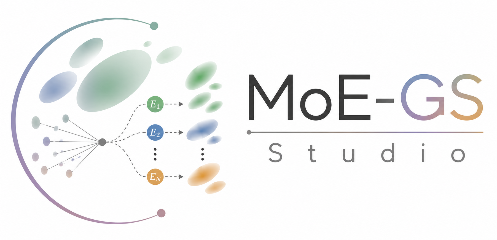

<div align="center">
  
</div>

<br>

# MoE-GS Studio

**MoE-GS Studio** summarizes our research series on **Mixture-of-Experts (MoE) for Dynamic Gaussian Splatting**.

This repository provides a compact overview of our MoE-based 4DGS papers and the core algorithmic ideas behind each work.

---

## News

- **2026.07**: **MoDE** paper is accepted to IEEE Transactions on Pattern Analysis and Machine Intelligence (TPAMI), 2026.
- **2026.07**: **MoDE** code repository is available. Please visit [github.com/cvsp-lab/MoDE](https://github.com/cvsp-lab/MoDE).
- **2026.07**: **MoE-GS Studio** is released as a central hub for our MoE-based Dynamic Gaussian Splatting research series.
- **2026.03**: **MoE-GS** code, paper, and project page are available. Please visit [github.com/cvsp-lab/MoE-GS](https://github.com/cvsp-lab/MoE-GS).
- **2026.01**: **MoE-GS** paper is accepted to ICLR 2026.

---

## Release Notes (v0.2.0)

- We add **MoDE**, our TPAMI 2026 work on Mixture of Deformation Experts for Dynamic Gaussian Splatting.
- We update the paper index to organize **MoE-GS** and **MoDE** as a unified MoE-based 4DGS research series.
- We add the **MoDE** paper and code links, along with a concise algorithm summary.

---

## Papers

| Project | Paper | Venue | Links |
| --- | --- | --- | --- |
| **MoE-GS** | Mixture of Experts for Dynamic Gaussian Splatting | ICLR 2026 | [Paper](https://arxiv.org/abs/2510.19210) / [Project Page](https://paper.pnu-cvsp.com/MoE-GS/) / [Code](https://github.com/cvsp-lab/MoE-GS) |
| **MoDE** | On the Design of Mixture-of-Experts for Dynamic Gaussian Splatting | IEEE TPAMI 2026 | [Paper](TPAMI-2026-03-0704.R1_Kong.pdf) / [Code](https://github.com/cvsp-lab/MoDE) |

---

## Research Series

### MoE-GS: Mixture of Experts for Dynamic Gaussian Splatting

**MoE-GS** introduces a Mixture-of-Experts framework for dynamic Gaussian splatting. It first trains multiple dynamic Gaussian experts independently and then learns a **volume-aware pixel router** that adaptively blends expert outputs across space, time, and viewing direction.

This design allows MoE-GS to combine heterogeneous 4DGS models without requiring them to share the same canonical Gaussian representation.

**Authors**: In-Hwan Jin*, Hyeongju Mun*, Joonsoo Kim, Kugjin Yun, and Kyeongbo Kong† (* equal contribution, † corresponding author)

### MoDE: Mixture of Deformation Experts

**MoDE** studies multi-deformation modeling for dynamic Gaussian splatting. Instead of relying on a single deformation model, MoDE integrates multiple deformation experts into a shared canonical Gaussian representation and jointly optimizes them within a unified dynamic Gaussian pipeline.

This design enables multiple deformation priors to cooperate directly at the representation level, providing an end-to-end alternative to routing independently trained full models.

**Authors**: In-Hwan Jin*, Hyeongju Mun*, Joonsoo Kim, Kugjin Yun, and Kyeongbo Kong† (* equal contribution, † corresponding author)

---

## Citation

If you find this series useful, please consider citing the relevant papers.

```bibtex
@inproceedings{jinmoegs2026,
    title={MoE-{GS}: Mixture of Experts for Dynamic Gaussian Splatting},
    author={In-Hwan Jin and Hyeongju Mun and Joonsoo Kim and Kugjin Yun and Kyeongbo Kong},
    booktitle={The Fourteenth International Conference on Learning Representations},
    year={2026}
}

@article{jinmode2026,
    title={On the Design of Mixture-of-Experts for Dynamic Gaussian Splatting},
    author={In-Hwan Jin and Hyeongju Mun and Joonsoo Kim and Kugjin Yun and Kyeongbo Kong},
    journal={IEEE Transactions on Pattern Analysis and Machine Intelligence},
    year={2026},
    note={Accepted}
}
```
